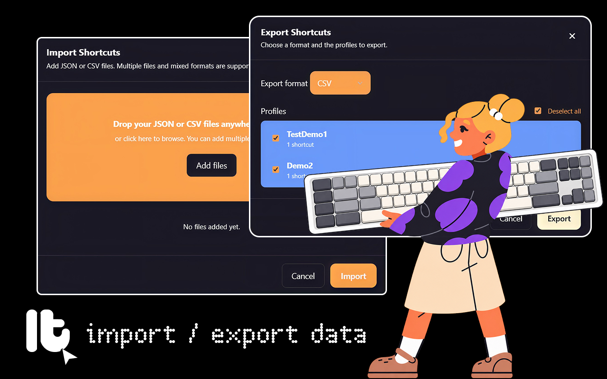
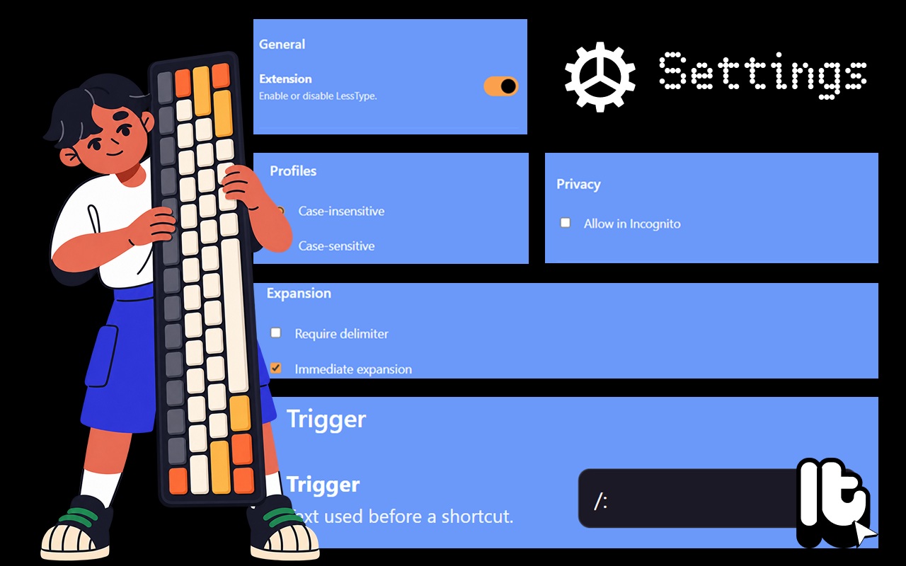
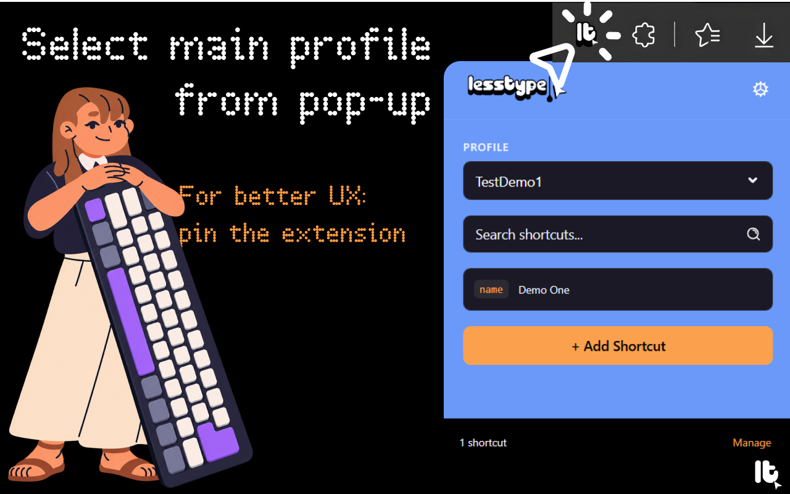
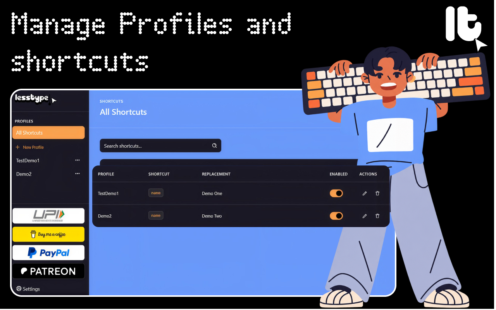
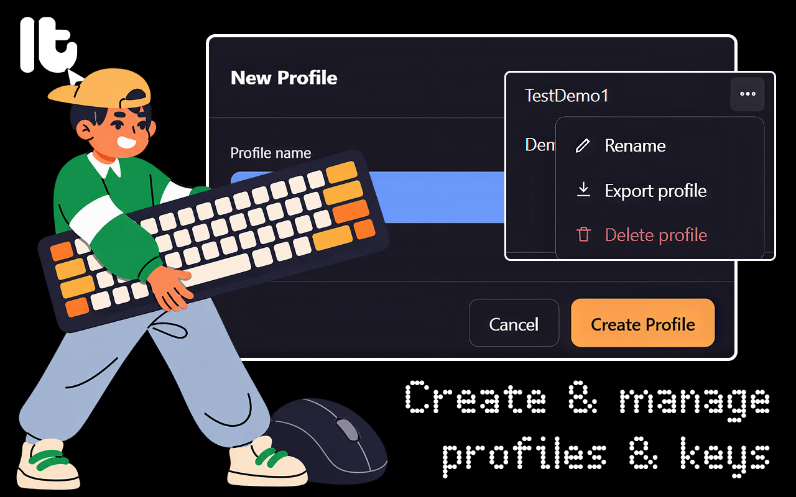
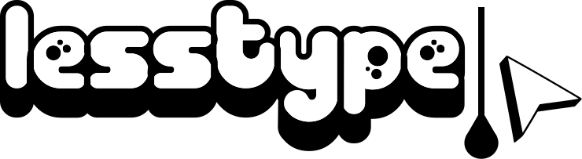

# LessType
<!--<p align="center">
    
</p>-->
<p align="center">
    
</p>

<p align="center">
<strong>Local-first text expansion for Chromium
browsers.</strong><br> Create reusable shortcuts,
organize them into profiles, and expand text directly where you type.
</p>


<p align="center">


</p>

> **LessType** is a lightweight, privacy-oriented text expansion
> extension designed around profiles, predictable shortcut resolution,
> and local browser storage.

------------------------------------------------------------------------

## Table of Contents

-   [Overview](#overview)
-   [Core Capabilities](#core-capabilities)
-   [How It Works](#how-it-works)
-   [Profile Model](#profile-model)
-   [Shortcut Resolution](#shortcut-resolution)
-   [Import and Export](#import-and-export)
-   [Settings](#settings)
-   [User Interface](#user-interface)
-   [Permissions and Privacy](#permissions-and-privacy)
-   [Installation](#installation)
-   [Contributing](#contributing)
-   [Support and Funding](#support-and-funding)
-   [License](#license)

------------------------------------------------------------------------

## Overview

LessType is a browser-native text expansion system for people who
repeatedly type the same words, phrases, templates, responses, snippets,
or structured text.

Instead of maintaining one large collection of shortcuts, LessType
organizes shortcuts into **profiles**. A profile can represent a
workflow, project, client, language, role, or any other context.

For example:

| Profile | Shortcut | Expansion |
| :--- | :--- | :--- |
| Personal | `email` | `name@example.com` |
| Work | `sig` | `Best regards,\nAlex` |
| Support | `refund` | A reusable refund response |
| Development | `pr` | A pull-request template |

The extension is built as a **Manifest V3 Chromium extension** and
stores its operational state through `chrome.storage.local`.<br>See in file:
[Lines 4–8](storage/storage.js#L4-L8), 
[Lines 22–26](storage/storage.js#L22-L26), and 
[Lines 31–35](storage/storage.js#L31-L35).

------------------------------------------------------------------------

## Core Capabilities

### Text Expansion

Type a trigger followed by a shortcut and LessType can replace it with
the configured text.

The default trigger is:

``` text
/:
```

For example:
``` text
/:email
```
can expand to:
``` text
name@example.com
```

LessType supports standard text controls and editable/content editable targets.<br>The content script monitors editable elements, reads the caret position, detects candidates, and performs the replacement.

### Profiles

Profiles provide isolated collections of shortcuts.

Profile names are unique according to the configured profile-name
matching policy.<br>Profile creation and renaming validate names before
persisting them.

Each profile can be:

-   Created
-   Selected
-   Renamed
-   Exported
-   Deleted

The dashboard exposes these actions through a per-profile kebab menu.
[See in file](dashboard/dashboard.js#L202-L259)

### Shortcut Management

Shortcuts support:

-   Shortcut key
-   Replacement text
-   Profile assignment
-   Enabled/disabled state
-   Editing
-   Deletion

Shortcut keys are unique within their profile, while the same shortcut
key may intentionally exist in multiple profiles.
[See in file](storage/storage.js#L61-L80)

### Profile-Aware Resolution

LessType is designed for situations where the same shortcut can mean
different things in different profiles.

Resolution follows this model:

> 1.  If the active profile contains the shortcut, use it immediately.
> 2.  If the active profile does not contain it but exactly one other
    profile contains it, use that match.
> 3.  If multiple non-active profiles contain it, do not guess. Present a
    temporary context menu so the user can choose the intended profile.
> 4.  If no profile contains it, do nothing.

This behavior is implemented in the content-script resolution pipeline.
[See in file](content/content.js#L585-L711)

### Ambiguous Shortcut Selection

When multiple non-selected profiles contain the same shortcut, LessType
creates a temporary browser context menu.

The menu identifies the shortcut and presents profile-specific
replacement values, for example:

``` text
LessType: "age"
├── Profile2 → 22
└── Profile3 → 23
```

The service worker creates this menu only when ambiguity is detected
rather than maintaining a permanent profile menu.
[See comment in file](background/service-worker.js#L80-L103)

------------------------------------------------------------------------

## How It Works

At a high level:

``` text
User types
    │
    ▼
Content Script
    │
    ├── Identify editable target
    ├── Read caret / selection
    ├── Detect trigger + shortcut
    └── Resolve matching profile(s)
             │
             ├── Single deterministic match
             │        │
             │        ▼
             │     Replace text
             │
             └── Multiple valid profiles
                      │
                      ▼
               Temporary context menu
                      │
                      ▼
               User chooses profile
                      │
                      ▼
                 Replace text
```

The content script keeps a local copy of extension state and invalidates
that state when profiles, shortcuts, or settings change in local
[See comment in file](content/content.js#L176-L239)

------------------------------------------------------------------------

## Profile Model

Profile names are unique according to the **Profile Name Case
Sensitivity** setting.

### Case-insensitive mode

By default, profile names are treated case-insensitively:

``` text
Work
work
WORK
```

are considered conflicting names.

### Case-sensitive mode

When enabled, casing differentiates profile names:

``` text
Work
work
WORK
```

can exist independently.

The default configuration uses case-insensitive profile matching.
[See in file](shared/constants.js#L13-L22)

When switching back to case-insensitive mode, LessType checks for
conflicts and prevents the setting from being enabled until conflicting
profiles are renamed. [See in file](settings/settings.js#L102-L137)

------------------------------------------------------------------------

## Shortcut Resolution

The expansion engine separates **candidate detection** from **profile
resolution**.

### Candidate detection

LessType:
> 1.  Locates the configured trigger.
> 2.  Reads the text following the trigger.
> 3.  Optionally requires a delimiter.
> 4.  Determines the shortcut key.
> 5.  Resolves the shortcut against stored profiles.

The default configuration requires a delimiter and does not use
immediate expansion. [See in file](shared/constants.js#L15-L16)

### Delimiter-aware expansion

Supported delimiters include common whitespace and punctuation
characters such as:

``` text
Space
Tab
Newline
,
.
;
:
!
?
)
]
}
(
[
{
<
>
'
"
`
-
_
```

The delimiter can be consumed as part of the expansion candidate while
preserving the intended text replacement behavior. [See in file](content/content.js#L16-L40)

------------------------------------------------------------------------

## Import and Export
<p align="center">
    
</p>

LessType provides structured data portability through **JSON** and
**CSV**.

### Export

Users can export selected profiles from Settings.

Supported formats:

-   JSON
-   CSV

JSON exports include a schema marker:

``` json
{
  "schemaVersion": 1,
  "type": "lesstype-shortcuts",
  "profile": {
    "name": "Work"
  },
  "shortcuts": [
    {
      "key": "email",
      "replacement": "name@example.com",
      "enabled": true
    }
  ]
}
```

The settings implementation exports each selected profile as its own. [See in file](settings/settings.js#L241-L372)

### CSV

CSV exports use:

``` csv
Profile,Shortcut,Replacement,Enabled
Work,email,name@example.com,true
```

### Import

Import accepts:

-   `.json`
-   `.csv`

Multiple files can be selected or dragged into the import interface. [See in file](settings/settings.js#L379-L593)

### Automatic Profile Creation

If an imported record references a profile that does not yet exist,
LessType creates the profile automatically.

This makes imports portable between independent installations or
environments without requiring users to manually recreate every profile
first. [See in file](settings/settings.js#L916-L938)

### Conflict Handling

When an imported shortcut already exists in the target profile, LessType
presents conflict controls:

-   Skip
-   Skip all
-   Overwrite
-   Overwrite all

This provides explicit control over whether imported data replaces
existing shortcut definitions.

------------------------------------------------------------------------

## Settings
<p align="center">
    
</p>

LessType exposes configurable behavior for:

### General

-   Global expansion enable/disable

### Trigger

-   Custom expansion trigger

### Expansion

-   Require delimiter
-   Immediate expansion

### Profiles

-   Case-sensitive profile-name matching

### Privacy

-   Incognito expansion behavior

### Data

-   Export shortcuts
-   Import shortcuts

These controls are loaded and persisted through the extension's local
state. [See in file](settings/settings.js#L9-L98)

------------------------------------------------------------------------

## User Interface

LessType uses a consistent dark interface with a compact,
desktop-oriented information hierarchy.

The design system is built around:

-   Deep navy surfaces
-   Cream accent color
-   High-contrast text
-   Compact spacing
-   Moderate corner radii
-   Subtle borders
-   Lightweight motion

The current theme defines the primary, secondary, tertiary, and accent
palette as well as typography, spacing, radii, shadows, and transitions.
[See in file](styles/theme.js#L1-L31). [See in file](styles/theme.js#L35-L91)

### Popup

The browser action popup provides a fast operational surface:

<p align="center">
    
</p>

The popup allows profile selection, shortcut search, quick inspection,
and access to the dashboard. [See in file](popup/popup.js#L76-L170)

### Dashboard
<p align="center">
    
</p>

The dashboard provides profile navigation, global shortcut search,
shortcut CRUD, enabled-state toggles, and profile actions.
[See in file](dashboard/dashboard.js#L54-L89), [See in file](dashboard/dashboard.js#L623-L768)

### Profile Menu
<p align="center">
    
</p>
Each profile has a kebab menu:

``` text
⋮
├── Rename
├── Export profile
└── Delete profile
```

Deleting a profile also removes the shortcuts associated with that
profile. [See in file](dashboard/dashboard.js#L161-L183)

------------------------------------------------------------------------

#### Content Script

Responsible for:

-   Detecting editable targets
-   Reading caret position
-   Detecting shortcut candidates
-   Resolving profile matches
-   Replacing text
-   Handling ambiguous shortcuts

The content script runs at `document_idle` across configured pages.
[See in file](content/content.js)

#### Service Worker

Responsible for:

-   Extension startup/installation handling
-   Context-menu lifecycle
-   Profile-selection callbacks
-   Runtime messaging

It deliberately keeps ambiguity menus temporary and removes them after
use. [See in file](background/service-worker.js#L35-L69), [See in file](background/service-worker.js#L300-L395)

#### Storage Layer

Profiles, shortcuts, and settings are stored through
`chrome.storage.local`. [See in file](storage/storage.js#L1-L25)  

#### UI Layer

The extension contains dedicated surfaces for:

-   Popup
-   Dashboard
-   Settings

Shared styling is defined through base/theme tokens, while each surface
has its own CSS.

------------------------------------------------------------------------


## Permissions and Privacy

LessType is designed around local browser storage rather than a hosted
synchronization service.

The current manifest requests:

``` text
storage
contextMenus
```

and declares page access for the content script.
fileciteturn0file8L5-L12

### Local-first storage

Profiles, shortcuts, and settings are persisted through the browser's
local extension storage. fileciteturn0file11L1-L25

### No required backend

The current architecture does not require a LessType server for normal
shortcut creation, editing, importing, exporting, or expansion.

### Incognito control

Incognito-like page expansion is disabled by default and can be
explicitly enabled in Settings. fileciteturn0file10L7-L13
fileciteturn0file10L837-L880

> **Security note:** The extension is configured to operate on web pages
> through a content script. Before publishing a production build, review
> the requested host permissions, browser-store policies, and the final
> codebase against the principle of least privilege.

------------------------------------------------------------------------

## Installation

### Load unpacked in Chromium

1.  Clone or download the repository.
2.  Open your Chromium-based browser.
3.  Navigate to the browser's extensions management page.
4.  Enable **Developer mode**.
5.  Choose **Load unpacked**.
6.  Select the LessType project directory.
7.  Open LessType from the browser toolbar.

The extension's manifest is already configured for Manifest V3 and
points to its popup, options page, content script, and service worker.
fileciteturn0file8L2-L29

### First-run setup

1.  Open LessType.
2.  Create a profile.
3.  Add a shortcut.
4.  Type the configured trigger followed by the shortcut in an editable
    web field.
5.  Complete the expansion.
6.  Add additional profiles when different contexts need different
    replacements.

------------------------------------------------------------------------

## Contributing

Contributions are welcome.

### Recommended workflow

1.  Fork the repository.
2.  Create a focused feature branch.
3.  Make the smallest coherent change.
4.  Test the affected popup, dashboard, settings, and page-expansion
    flows.
5.  Verify import/export compatibility where relevant.
6.  Update documentation for user-visible behavior.
7.  Open a pull request with:
    -   Problem statement
    -   Implementation summary
    -   Testing performed
    -   Screenshots for UI changes
    -   Compatibility considerations

### Code quality expectations

Please prioritize:

-   Clear naming
-   Small functions
-   Defensive browser API usage
-   Explicit validation
-   Accessible controls
-   Consistent UI behavior
-   Backward-compatible data handling
-   No unnecessary dependencies

------------------------------------------------------------------------

## Support and Funding

LessType is intended to remain approachable, privacy-conscious, and
useful as an open project. If you find it valuable, consider supporting
continued development.

> **Publishing note:** Replace the placeholder links below with the
> project's official creator/account URLs before publishing this README.

<a href="assets/payments.png">
    
</a>
<a href="https://paypal.me/utkarshnaman2301">
    
</a>
<a href="https://buymeacoffee.com/utkarshnaman">
    
</a>
<a href="https://www.patreon.com/c/utnam">
    
</a>

### Funding Banner

``` text
┌─────────────────────────────────────────────────────────────────────┐
│                         SUPPORT LESSTYPE                            │
│                                                                     │
│  Help fund maintenance, accessibility, browser compatibility,       │
│  documentation, testing, and new text-expansion capabilities.       │
│                                                                     │
│     [ UPI ]   [ PayPal ]   [ Buy Me a Coffee ]   [ Patreon ]        │
└─────────────────────────────────────────────────────────────────────┘
```

------------------------------------------------------------------------

## Branding

The LessType logo is kept in the repository at:

<p align="center">
  
</p>

``` text
assets/Less-Type-logo.svg
```

<p align="center">
  
</p>

``` text
assets/LESSTYPE.svg
```

The product UI currently uses a BLUE-ORANGE and cream visual language,
with semantic success, warning, and danger states defined separately.

------------------------------------------------------------------------

## License

Add the project's chosen open-source license to the repository before
public release.

For example:

``` text
MIT License
Copyright (c) <YEAR> <AUTHOR / ORGANIZATION>
```

If the project is intended to be proprietary or source-available
instead, replace this section with the applicable license terms.

------------------------------------------------------------------------